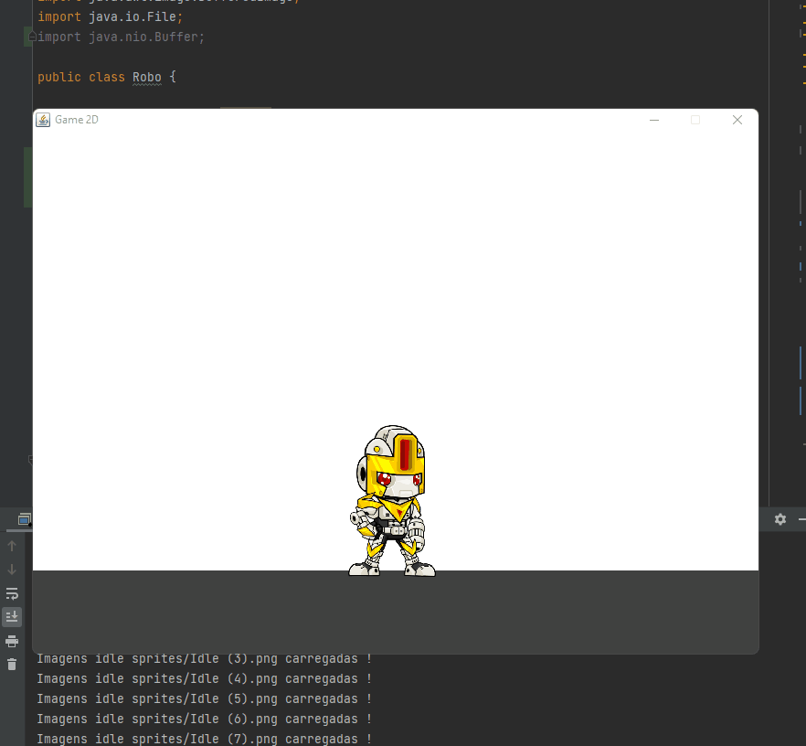

<h2 align="center">
Game 2D
</h2>

Aqui iremos criar uma janela com as funções, centralizar, não redimensionar, fechar ou minimizar e
tamanho da largura e altura.

<h1 align="center">

</h1>

<h2 align="center">
Desenhando
</h2>

Para testar iremos desenhar um quadrado azul, imagine como se fosse nosso primeiro personagem.

<h1 align="center">

</h1>

<h2 align="center">
Testando movimento
</h2>

Para fazer o teste de game loop, aqui foi feito a nossa Thread, não sendo uma coisa apenas 
executada, onde atualiza o movimento, desenhando, limpando e rodando em 60fps.

<h1 align="center">

</h1>

<h2 align="center">
Movimento robo Correndo
</h2>

Criaremos classe Robo aonde será testado o movimento de correr controlando sua velocidade com o
atributo timer.

<h1 align="center">

</h1>

<h2 align="center">
Correndo para direita e esquerda
</h2>

Iremos implementar os métodos do Keylistener, para sim usar a tecla de ação, para o robo se deslocar 
do lugar

<h1 align="center">

</h1>

<h2 align="center">
Movimento Idle
</h2>

Agora iremos criar o movimento dele parado(idle), quando o personagem parar, tanto para direita como 
para esquerda ele irar exibir sequências de sprites Idle.

<h1 align="center">

</h1>

<h2 align="center">
Movimento Pulo 
</h2>

Nesta parte iremos adicionar a parte do pulo do personagem, tanto para esquerda como para direita.

<h1 align="center">

</h1>

<h2 align="center">
Movimento descansando 
</h2>

Aqui iremos fazer com que o personagem robo descanse, usando a letra "m" do teclado, para o mesmo
como tivesse tomado algum tipo de dano. 

<h1 align="center">

</h1>
